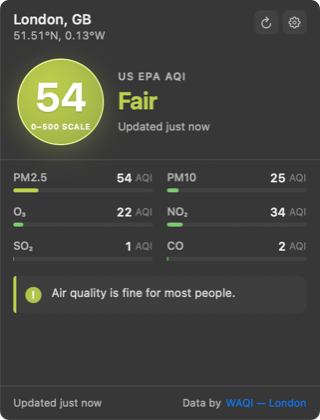
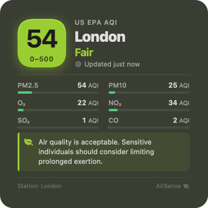

# AirSense — Air Quality Widget for macOS

[](LICENSE)
[]()

Native macOS menu-bar widget that shows the current air quality (AQI + pollutant breakdown) for a chosen city. Defaults to the free public [Open-Meteo](https://open-meteo.com) Air Quality API, and offers an opt-in [World Air Quality Index (WAQI)](https://aqicn.org) ground-station provider for higher accuracy.

## Features

- Menu-bar status item showing AQI category colour and optional numeric value
- Popover with current AQI, per-pollutant readings (PM2.5, PM10, O₃, NO₂, SO₂, CO), and a health recommendation
- City search (Open-Meteo geocoding) or "use current location" via CoreLocation
- European AQI (1–6) and US EPA AQI (0–500) standards
- Two interchangeable data sources:
  - **Open-Meteo** (default, no signup) — CAMS forecast model on a ~11 km grid
  - **WAQI / aqicn.org** (opt-in, free token) — aggregated ground stations, usually matches IQAir for the same city. Token stored in the macOS Keychain.
- Offline-aware: caches the last good snapshot and shows stale/retry states with the actual error message
- Sparkle-backed in-app update button when a newer GitHub Release is available
- Launch at login (SMAppService) and localisation-ready (`Localizable.xcstrings`)

## Install (end users)

1. Download `AirSense-<version>.zip` from the latest [GitHub Release](../../releases).
2. Unzip and drag `AirSense.app` to `/Applications`.
3. First launch will be blocked because the binary is ad-hoc signed. Open **System Settings → Privacy & Security**, scroll to the message about AirSense, and click **Open anyway**.
4. Grant location permission only if you want to use "detect current city"; city search works without it.

### System requirements

- macOS 15 Sequoia or newer
- Apple silicon or Intel

## Build from source (developers)

### Requirements

- macOS 15 Sequoia or newer
- Xcode 15+ (verified with Xcode 26 on macOS 15)
- [XcodeGen](https://github.com/yonaskolb/XcodeGen) — generates `AirSense.xcodeproj` from `project.yml`
- [SwiftLint](https://github.com/realm/SwiftLint) — optional, used by CI
- [Sparkle](https://sparkle-project.org) signing tools — required only when publishing the auto-update appcast

### Setup

```sh
make setup     # installs xcodegen + swiftlint via Homebrew and generates the Xcode project
open AirSense.xcodeproj
```

Or manually:

```sh
brew install xcodegen swiftlint
xcodegen generate
```

The generated `.xcodeproj` is intentionally gitignored — `project.yml` is the source of truth.

### Common commands

| Command        | Purpose                                  |
|----------------|------------------------------------------|
| `make generate`| Re-run XcodeGen after editing `project.yml` |
| `make build`   | Build the app from the command line      |
| `make test`    | Run unit tests                           |
| `make lint`    | Run SwiftLint in strict mode             |
| `make release-with-appcast` | Build the release ZIP and regenerate `docs/appcast.xml` |
| `make clean`   | Remove build artefacts and generated project |

## Signing

MVP ships **without a Developer ID signature**. The project uses Xcode's ad-hoc "Sign to Run Locally" signing. When launching a distributed build for the first time, macOS will block it — open *System Settings → Privacy & Security* and choose *Open anyway*. Developer ID signing + notarisation is tracked for a later release.

Auto-updates use Sparkle and GitHub Pages. Release builds embed the checked-in `SPARKLE_PUBLIC_ED_KEY`, and `scripts/generate_appcast.sh` must be run with Sparkle's `sign_update` tool available so `docs/appcast.xml` contains a signed enclosure for `AirSense-<version>.zip`. The release workflow publishes the appcast to the `gh-pages` branch; configure GitHub Pages once with source `Deploy from a branch`, branch `gh-pages`, folder `/`.

## Privacy

AirSense talks only to `api.open-meteo.com` for the default provider and `api.waqi.info` when WAQI is enabled. Geocoding always runs against `api.open-meteo.com`. No user data is uploaded. Location permission is optional and used solely to resolve the nearest city for a foreground lookup — the coordinate is not stored beyond that request.

When you enter a WAQI token it is stored in the per-app macOS Keychain (`kSecAttrAccessibleAfterFirstUnlock`). It never leaves your Mac except as a query string to `api.waqi.info`.

## Data attribution

- Default: air-quality and geocoding data by [Open-Meteo](https://open-meteo.com).
- Optional: aggregated ground-station readings by the [World Air Quality Index Project](https://aqicn.org), plus the per-station attributions that WAQI returns for every response (visible in Settings → About).

Attribution strings are also rendered inside the popover footer and Settings → About.

## Enabling WAQI (optional, more accurate)

1. Create a free token at <https://aqicn.org/data-platform/token/>.
2. Open **Settings → Data Source**, pick **World Air Quality Index**, paste the token, press **Save**.
3. Press **Test connection** — on success the next refresh will pull ground-station readings.

## Screenshots

| Menu bar popover | Notification Center widget |
|------------------|----------------------------|
|  |  |

## Contributing

Contributions are welcome. By submitting a pull request you agree that your contribution is licensed under the Apache License, Version 2.0 (see [LICENSE](LICENSE)), and that you have the right to license it under those terms.

## License

Licensed under the [Apache License, Version 2.0](LICENSE). See [NOTICE](NOTICE) for attribution of the runtime data sources AirSense relies on.

Unless required by applicable law or agreed to in writing, software distributed under the License is distributed on an **"AS IS" BASIS, WITHOUT WARRANTIES OR CONDITIONS OF ANY KIND**, either express or implied.
